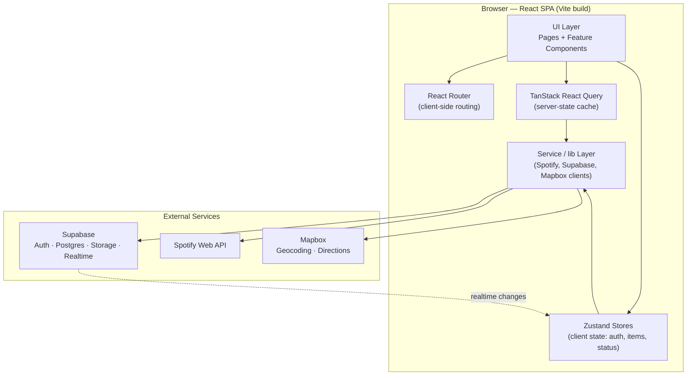
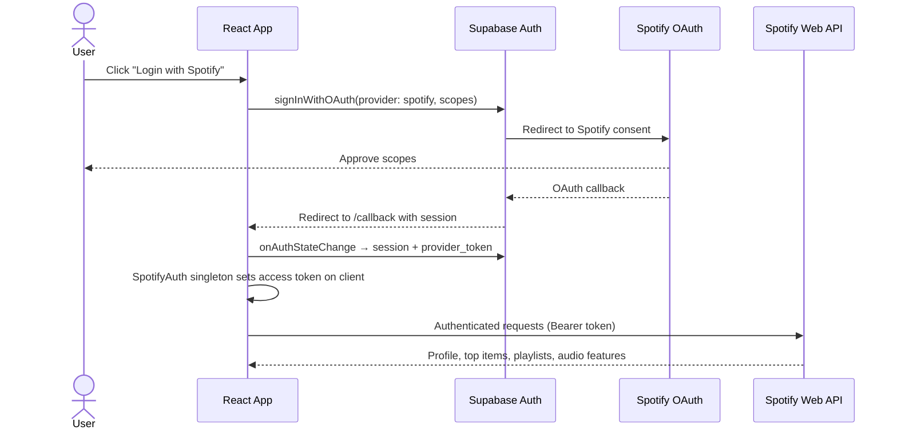
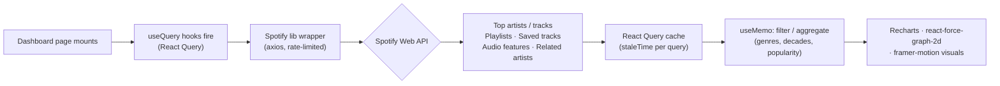
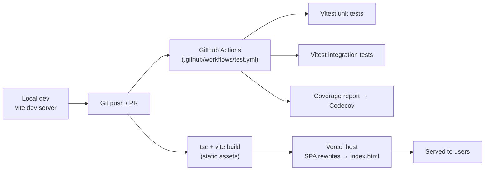

# MusicBucket
### A Spotify-Powered Music Discovery, Analytics & Collection Platform


---

## Table of Contents

1. [Project Overview](#1-project-overview)
2. [Feature Suite](#2-feature-suite)
3. [Data Sources & Data Model](#3-data-sources--data-model)
4. [Architecture](#4-architecture)
   - [4.1 System & Component Architecture](#41-system--component-architecture)
   - [4.2 Authentication & Request Flow](#42-authentication--request-flow)
   - [4.3 Dashboard Data Flow](#43-dashboard-data-flow)
   - [4.4 Build & Deploy Pipeline](#44-build--deploy-pipeline)
   - [4.5 Sequence: Saving a Road-Trip Playlist](#45-sequence-saving-a-road-trip-playlist)
5. [Repository Structure](#5-repository-structure)
6. [Technology Stack](#6-technology-stack)
7. [How It Works (Methodology)](#7-how-it-works-methodology)
8. [Setup & Installation](#8-setup--installation)
9. [Running the Application](#9-running-the-application)
10. [Environment Variables Reference](#10-environment-variables-reference)
11. [Testing](#11-testing)
12. [Notes & Characteristics](#12-notes--characteristics)
13. [Roadmap / Future Work](#13-roadmap--future-work)
14. [Appendix — Glossary](#14-appendix--glossary)

---

## 1. Project Overview

**MusicBucket** is a single-page web application that turns a user's Spotify account into a rich, interactive music workspace. After signing in with Spotify, a user can:

- **Analyse their listening profile** — top artists/tracks, genre breakdowns, library growth over time, popularity highlights, and an artist-relationship network graph.
- **Build and share music bucket lists** — curated, collaborative collections of tracks, artists, albums and playlists with import-from-Spotify, public sharing, and invite links.
- **Rank music in tier lists** — a drag-and-drop S/A/B/C/D tier maker with PNG export and public sharing.
- **Generate road-trip mixtapes** — enter a start and end location, and the app maps the driving route and assembles a playlist from artists associated with the regions along the way, optionally saving it back to Spotify.

The application is a **client-rendered React + TypeScript SPA** built with **Vite**, styled with **Tailwind CSS**, and backed by **Supabase** (PostgreSQL, authentication, row-level security, storage, and realtime). Spotify is the primary external data provider; **Mapbox** supplies geocoding and routing for the road-trip feature.

The codebase is organised by **feature domain** — each major feature (Dashboard, Bucket List, Tier Maker, Road Trip Mixtape, etc.) owns its own folders under `components/`, `services/`, `store/`, `lib/`, `hooks/`, and `types/`, keeping concerns isolated and the app easy to extend.

---

## 2. Feature Suite

| Feature | Route | Summary |
|---|---|---|
| **Home** | `/` | Landing page with feature cards and Spotify login. |
| **Dashboard** | `/dashboard` | Personal listening analytics — top charts, genres, decade chart, playlist composition, library growth, artist network graph, popularity highlights, achievements, and a "Music Taste Analyzer" personality profile. |
| **Bucket List** | `/bucket-list` | Multi-list CRUD for music items, Spotify import, drag-to-reorder, mark-as-listened, themes, collaborators, public sharing, invite links, and discovery of other public lists. |
| **Tier Maker** | `/tiermaker` | Drag-and-drop tier list builder for artists/albums/tracks with image export and public sharing. |
| **Road Trip Mixtape** | `/roadtrip-mixtape` | Route-aware playlist generator with an interactive map; saves the result to Spotify. |
| **Public pages** | `/bucketlist/share/:id`, `/bucketlist/join/:token` | Read-only and join-by-token entry points for shared bucket lists. |
| **Static pages** | `/about`, `/support`, `/privacy`, `/terms` | Informational content. |

> The repository also contains additional feature modules — **Artist Exploration**, **Recommendation Roulette**, and **Culture Clash** — whose UI and logic are implemented and reachable in development, with their routes currently held behind a production gate while they are finalised (see [Roadmap](#13-roadmap--future-work)).

---

## 3. Data Sources & Data Model

### External data sources

| Source | Used by | Provides |
|---|---|---|
| **Spotify Web API** | All music features | User profile, top artists/tracks, playlists, saved tracks/albums, audio features, related artists, search, recommendations, playlist creation. |
| **Mapbox** (Geocoding + Directions) | Road Trip Mixtape | Location search/autocomplete, reverse geocoding of route waypoints, driving routes and trip duration. |
| **Supabase** | App-wide | Authentication (Spotify OAuth provider), PostgreSQL persistence, row-level security, file storage (cover images), and realtime change streams. |

### Persisted data model (Supabase / PostgreSQL)

Schema is defined and evolved through SQL migrations in `supabase/migrations/`. The core relational model:

| Table | Purpose |
|---|---|
| `profiles` | User metadata mirrored from the auth user record. |
| `bucket_lists` | A user's bucket-list containers (name, description, theme, visibility, cover image). |
| `bucket_list_items` | Items within a list (type, title, Spotify id, image, notes, completed flag, position). |
| `bucket_list_collaborators` | Users granted shared edit access to a list. |
| `bucket_list_invites` | Tokenised invite links for joining a list. |
| `tier_lists` / `tiers` / `tier_list_placements` | Normalised tier-maker storage: a list, its rows, and item placements. |

All tables are protected by **Row-Level Security (RLS)** policies so that users can read and write only their own data, while public/shared resources are explicitly readable. Client-side, a lightweight **IndexedDB** store (`idb`) is also available for local caching of bucket-list items.

---

## 4. Architecture

### 4.1 System & Component Architecture



*Figure 1 — High-level component architecture. The React SPA holds all application logic; React Query manages cached server state, Zustand manages client state, and a service/lib layer brokers all calls to Spotify, Supabase, and Mapbox.*

### 4.2 Authentication & Request Flow



*Figure 2 — Authentication and request flow. Spotify sign-in is delegated to Supabase's OAuth provider; the resulting `provider_token` is propagated to the in-app Spotify client singleton, which authorises all subsequent Spotify Web API calls.*

### 4.3 Dashboard Data Flow



*Figure 3 — Dashboard data flow. Visualisations are derived client-side: raw Spotify responses are cached by React Query, aggregated with memoised selectors, and rendered through charting libraries.*

### 4.4 Build & Deploy Pipeline



*Figure 4 — Build and deployment pipeline. Pushes trigger a GitHub Actions test suite; the production build is a type-checked Vite bundle served as a static SPA with catch-all rewrites (configured in `vercel.json`).*

### 4.5 Sequence: Saving a Road-Trip Playlist

```mermaid
sequenceDiagram
    actor User
    participant UI as RoadTripMixtape UI
    participant Geo as Mapbox (geocoding/directions)
    participant Gen as Playlist generator
    participant Spot as Spotify Web API

    User->>UI: Enter start & end location
    UI->>Geo: getRoute(start, end)
    Geo-->>UI: Route polyline + duration
    UI->>Geo: Reverse-geocode sampled waypoints (~50km)
    Geo-->>UI: Region names along the route
    UI->>Gen: generatePlaylist(regions, duration)
    Gen->>Spot: Search artists by region; fetch top tracks
    Spot-->>Gen: Artists + tracks
    Gen-->>UI: Sequenced track list (~ trip length)
    User->>UI: Save to Spotify
    UI->>Spot: Create playlist + add tracks (+ cover image)
    Spot-->>UI: Playlist URL
```

*Figure 5 — Sequence diagram for the road-trip playlist generator: route geometry from Mapbox drives region detection, which seeds Spotify artist/track lookups, finally writing a new playlist back to the user's Spotify account.*

---

## 5. Repository Structure

```text
MusicBucket/
├── index.html                     # Vite HTML entry
├── package.json                   # Scripts & dependencies
├── vite.config.ts                 # Vite config (React plugin, "@" alias)
├── vitest.config.ts               # Vitest (jsdom, coverage, setup file)
├── cypress.config.ts              # Cypress E2E config (baseUrl :5173)
├── tailwind.config.js             # Theme tokens (primary/secondary palette, dark mode)
├── postcss.config.js              # Tailwind + Autoprefixer
├── eslint.config.js               # TypeScript + React Hooks lint rules
├── tsconfig*.json                 # App / Node / Cypress TS project references
├── vercel.json                    # SPA rewrites (all paths → index.html)
├── .env.example                   # Environment variable template (names only)
├── .github/workflows/test.yml     # CI: install, unit + integration tests, coverage
├── public/
│   └── data/indiaMusicCulture.json # Static culture dataset
├── supabase/
│   └── migrations/*.sql            # Postgres schema + RLS policies (source of truth)
├── cypress/                        # E2E harness (config, support, specs)
└── src/
    ├── main.tsx                    # App bootstrap (Router + App)
    ├── App.tsx                     # Route table + providers (React Query, layout)
    ├── index.css                   # Tailwind layers + globals
    ├── components/
    │   ├── Layout.tsx              # Shell: nav + footer + realtime banner + <Outlet/>
    │   ├── Navigation.tsx          # Top nav, theme toggle, Spotify profile dropdown
    │   ├── Dashboard/              # Charts & analytics widgets (Recharts, force graph)
    │   ├── Bucket_List/            # List grid, detail view, panels, modals, import
    │   ├── TierMaker/              # Drag-and-drop tier board, item bank, export
    │   ├── Road_Trip_Mixtape/      # Map, location input, playlist view/editor
    │   ├── Artist_Exploration/     # Artist deep-dive & scoring UI
    │   ├── Recommendation_Roulette/# Spin-wheel UI + shadcn/ui component kit
    │   ├── CultureClash/           # 3D globe + country info panel
    │   └── SonicSaga/              # Collectible artist-card UI
    ├── pages/                      # Top-level route components (one per screen)
    ├── services/                   # Domain service layer (Supabase CRUD, geocoding…)
    ├── store/                      # Zustand stores (auth, items, status flags)
    ├── lib/                        # External-client wrappers (Spotify, Supabase, Mapbox)
    ├── hooks/                      # Reusable hooks (auth, theme, debounce, undo/redo)
    ├── types/                      # Shared TypeScript types per domain
    ├── utils/                      # Pure helpers (scoring weights, formatting, cn)
    ├── db/ & lib/Bucket_List/db/   # Local persistence helpers (IndexedDB)
    └── tests/                      # Vitest unit + integration tests, MSW mocks, fixtures
```

Generated and environment-specific artifacts (`node_modules/`, `dist/`, `.env`) are intentionally excluded from version control.

---

## 6. Technology Stack

| Layer | Technology | Role in MusicBucket |
|---|---|---|
| **Language** | TypeScript 5.5 | Type-safe application code across the SPA. |
| **UI library** | React 18.3 | Component model, hooks, concurrent rendering. |
| **Build tool** | Vite 7 | Dev server (HMR) and production bundler. |
| **Routing** | React Router 6 | Client-side routing, nested layout routes, route params. |
| **Styling** | Tailwind CSS 3.4 + PostCSS + Autoprefixer | Utility-first styling with a custom brand palette and class-based dark mode. |
| **UI primitives** | Radix UI + `class-variance-authority` + `tailwind-merge` (shadcn/ui style) | Accessible, composable components (dialogs, dropdowns, tooltips, etc.). |
| **Animation** | Framer Motion | Page and widget animations. |
| **Server state** | TanStack React Query 5 | Caching, deduping, and lifecycle of remote data. |
| **Client state** | Zustand 4 | Lightweight stores for auth, list items, and status flags. |
| **Backend platform** | Supabase (`@supabase/supabase-js`) | Auth (Spotify OAuth), PostgreSQL, RLS, storage, realtime. |
| **Local cache** | `idb` (IndexedDB) | Client-side persistence helper for bucket-list items. |
| **Spotify clients** | `spotify-web-api-js` (primary), `@spotify/web-api-ts-sdk` (playlist writes) | Reading library data and creating playlists. |
| **HTTP** | Axios | Rate-limited Spotify/Mapbox request wrappers. |
| **Maps** | `mapbox-gl`, `react-map-gl`, `react-globe.gl` | Route map and 3D globe rendering. |
| **Charts / viz** | Recharts, `react-force-graph-2d` | Bar/line/pie charts and the artist network graph. |
| **Drag & drop** | `@dnd-kit/core`, `@dnd-kit/sortable` | Tier-maker drag interactions. |
| **Image export** | `html2canvas` | Exporting tier lists as PNG. |
| **Forms / validation** | `react-hook-form`, `zod`, `@hookform/resolvers` | Typed form handling and schema validation. |
| **Notifications** | `react-hot-toast`, `sonner` | Toast feedback. |
| **Icons** | `lucide-react`, `react-icons`, `@radix-ui/react-icons` | Iconography. |
| **Theming** | `next-themes` | Light/dark theme management. |
| **Dates** | `date-fns` | Date parsing/formatting in analytics. |
| **Testing** | Vitest, Testing Library, MSW, jsdom, Cypress | Unit, integration (mocked network), and E2E harness. |
| **CI / hosting** | GitHub Actions, Codecov, Vercel | Automated tests, coverage, static SPA hosting. |

---

## 7. How It Works (Methodology)

1. **Authenticate once, reuse everywhere.** Sign-in is delegated to Supabase's Spotify OAuth provider. A single `SpotifyAuth` singleton subscribes to Supabase auth-state changes and injects the resulting access token into the shared Spotify client, so every feature shares one authenticated session.

2. **Fetch with React Query, cache aggressively.** Remote reads (profile, top items, playlists, saved tracks, audio features) go through feature `lib`/`service` wrappers and are cached by React Query with per-query stale times. The Spotify wrapper applies **exponential backoff on HTTP 429** so rate limits degrade gracefully rather than failing hard.

3. **Derive insight on the client.** The Dashboard computes its analytics with memoised selectors — grouping tracks by decade, aggregating genres from top artists, ranking by Spotify popularity, and building an artist-relationship graph from related-artist lookups — then renders them with Recharts, a force-directed graph, and Framer Motion.

4. **Persist user creations in Supabase.** Bucket lists, items, collaborators, invites, and tier lists are stored in PostgreSQL with RLS. Mutations use **optimistic UI updates** in Zustand for snappy interactions, then reconcile with the database through the service layer.

5. **Compose external services for richer features.** Road Trip Mixtape orchestrates Mapbox (route + reverse geocoding) and Spotify (artist search + top tracks + playlist creation) into a single user flow, sampling the route every ~50 km and budgeting tracks against the trip's duration.

---

## 8. Setup & Installation

### Prerequisites

| Dependency | Version | Notes |
|---|---|---|
| Node.js | 18+ | CI runs on Node 18; Vite 7 supports modern LTS releases. |
| npm | 9+ | Ships with Node 18. |
| Spotify Developer app | — | Client ID/secret and a registered redirect URI. |
| Supabase project | — | URL + anon key; Spotify configured as an OAuth provider. |
| Mapbox account | — | Access token (for Road Trip Mixtape). |

### Install

```bash
git clone <your-repo-url> MusicBucket
cd MusicBucket
npm ci          # or: npm install
```

### Configure environment

Copy the template and fill in your own values. All configuration is read from environment variables (the real `.env` file is git-ignored):

```bash
cp .env.example .env
# then edit .env with your own credentials
```

See [Environment Variables Reference](#10-environment-variables-reference) for the full list of variable **names**.

### Apply database schema (Supabase)

Apply the SQL migrations in `supabase/migrations/` to your Supabase project (via the Supabase CLI or the SQL editor) so the required tables and RLS policies exist.

---

## 9. Running the Application

```bash
# Development server (hot reload) — http://localhost:5173
npm run dev

# Production build (type-check + bundle)
npm run build

# Preview the production build locally
npm run preview

# Lint
npm run lint
```

**Deployment.** The app builds to static assets and is hosted on Vercel. `vercel.json` rewrites all routes to `index.html` so client-side routing works on deep links and refreshes.

---

## 10. Environment Variables Reference

All values are supplied via environment variables and are **not** committed to the repository. Variable **names** only:

| Variable | Purpose |
|---|---|
| `VITE_SPOTIFY_CLIENT_ID` | Spotify application client id. |
| `VITE_SPOTIFY_CLIENT_SECRET` | Spotify application client secret. |
| `VITE_SPOTIFY_REDIRECT_URI` | OAuth redirect URI (e.g. the app's `/callback`). |
| `VITE_SUPABASE_URL` | Supabase project URL. |
| `VITE_SUPABASE_ANON_KEY` | Supabase public anon key. |
| `VITE_MAPBOX_ACCESS_TOKEN` | Mapbox access token for maps/geocoding. |
| `VITE_APP_URL` | Public base URL of the app. |
| `VITE_API_URL` | Base URL for any companion API endpoint. |
| `VITE_ENABLE_ANALYTICS` | Optional feature flag. |
| `VITE_ENABLE_OFFLINE_MODE` | Optional feature flag. |
| `VITE_DEBUG_MODE` | Optional verbose-logging flag. |
| `NODE_ENV` | Standard environment indicator. |

> Refer to `.env.example` for the canonical list. Never commit real credentials; keep them in your local `.env` (git-ignored).

---

## 11. Testing

| Command | What it runs |
|---|---|
| `npm test` | Vitest in watch mode. |
| `npm run test:unit` | Unit tests (`src/tests/unit`). |
| `npm run test:integration` | Integration tests with **MSW**-mocked network (`src/tests/integration`). |
| `npm run test:coverage` | Coverage report (V8 provider). |
| `npm run test:e2e` | Cypress end-to-end run. |
| `npm run test:e2e:open` | Cypress interactive runner. |
| `npm run test:all` | Unit → integration → E2E in sequence. |

- **Unit tests** cover components (`FeatureCard`, `Navigation`, `ThemeToggle`), the `useTheme` hook, the auth store, and the `cn` utility.
- **Integration tests** exercise the Spotify API layer, the Bucket List, and the Dashboard against **Mock Service Worker** handlers, so tests run without hitting live services.
- **CI** (`.github/workflows/test.yml`) installs dependencies and runs the unit, integration, and coverage steps on every push and pull request, uploading coverage to Codecov.

---

## 12. Notes & Characteristics

- **Feature-domain layout.** Each major feature is self-contained across `components/`, `services/`, `store/`, `lib/`, `hooks/`, and `types/`, which keeps features independently understandable and extendable.
- **Single shared Spotify session.** A singleton auth manager ensures all features authorise against one Spotify token sourced from the Supabase session.
- **Resilient API access.** Spotify requests retry with exponential backoff on rate limits, and status stores surface degraded-service banners (Spotify, Mapbox, Supabase realtime) to the UI.
- **Optimistic interactions.** List and tier mutations update the UI immediately and reconcile with Supabase, keeping the experience responsive.
- **Security posture.** Secrets are provided through environment variables; database access is governed by Supabase Row-Level Security so users can only touch their own data, with public/shared resources explicitly opened.

---

## 13. Roadmap / Future Work

- **Promote in-progress features to production.** Finalise and enable **Artist Exploration** (weighted artist "exploration score"), **Recommendation Roulette** (spin-to-discover), and **Culture Clash** (3D-globe cultural exploration), which currently run in development behind a production gate; expand Culture Clash beyond its initial dataset.
- **Server-side token refresh.** Add automatic Spotify token refresh to extend long sessions seamlessly.
- **Unify the data/auth layer.** Consolidate overlapping Spotify client wrappers and auth stores into a single source of truth.
- **Deepen collaboration.** Wire bucket-list comments and live collaborator presence on top of the existing Supabase realtime plumbing.
- **Richer playlist generation.** Add tempo/energy/genre-aware sequencing to Road Trip Mixtape for smoother journeys.
- **Expand the automated test suite.** Add end-to-end coverage for core flows (login, list CRUD, playlist creation) and enforce coverage thresholds in CI.

---

## 14. Appendix — Glossary

| Term | Meaning |
|---|---|
| **SPA** | Single-Page Application — the browser loads one HTML shell and React swaps views client-side. |
| **OAuth** | Authorization protocol used to obtain a Spotify access token via Supabase without handling the user's password. |
| **RLS** | Row-Level Security — PostgreSQL policies that restrict which rows a user may read/write. |
| **React Query** | Library that caches and synchronises remote (server) state. |
| **Zustand** | Minimal client-state store used for auth, list items, and status flags. |
| **Audio features** | Spotify-provided numeric track attributes (danceability, energy, valence, etc.). |
| **MSW** | Mock Service Worker — intercepts network calls in tests so they run offline and deterministically. |
| **HMR** | Hot Module Replacement — Vite's instant in-place module updates during development. |

---

<div align="center">
  <sub>MusicBucket · React · TypeScript · Vite · Supabase · Spotify</sub>
</div>
